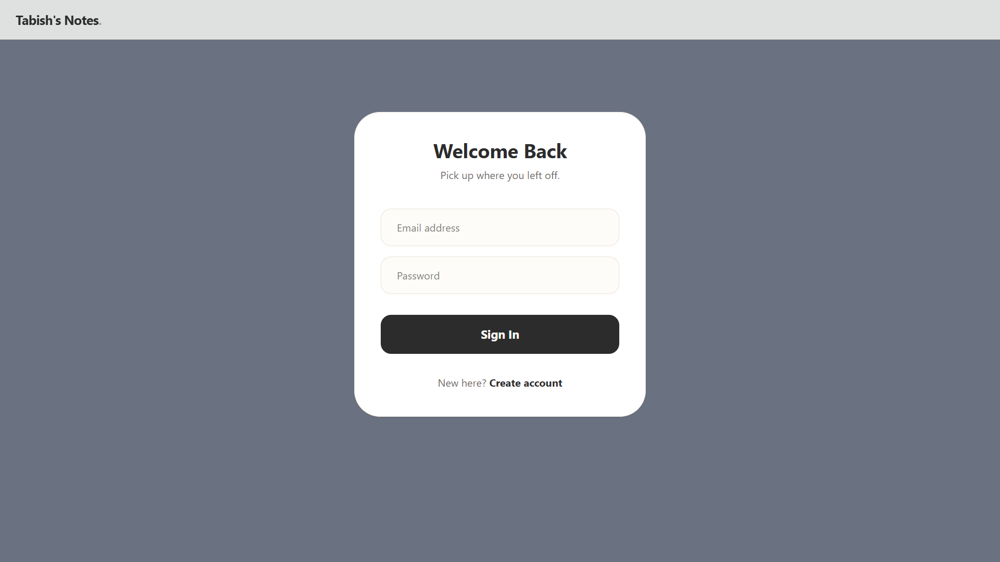

# 📝 Markdown Content Manager

A sleek, full-stack application for everyone to manage markdown notes with a warm minimalist design.

## 📸 Gallery
| Login Page | Dashboard |
|------------|-----------|
|  |  |

## 🚀 Key Features

* **Secure Authentication**: User signup and login powered by JWT and bcryptjs.
* **Cloud Backend**: Integrated with Supabase for backend services.
* **Dynamic UI**: Single-page application built with React 18 and Tailwind CSS 4.
* **Note Management**: Create and organize markdown-based notes.

## 🛠️ Tech Stack

* **Frontend**: React, Vite, Tailwind CSS, Axios.
* **Backend**: Node.js, Express 5.
* **Services**: Supabase.
* **Dev Tools**: Nodemon.

## 💻 Getting Started

### Installation

1. **Install Dependencies**:
```bash
npm install
cd frontend && npm install

```


2. **Environment Setup**:
Create a `.env` file in the `backend/` directory and add your `JWT_SECRET` and Supabase credentials.

### Running the Project

* **Development Mode**:
```bash
npm run dev

```